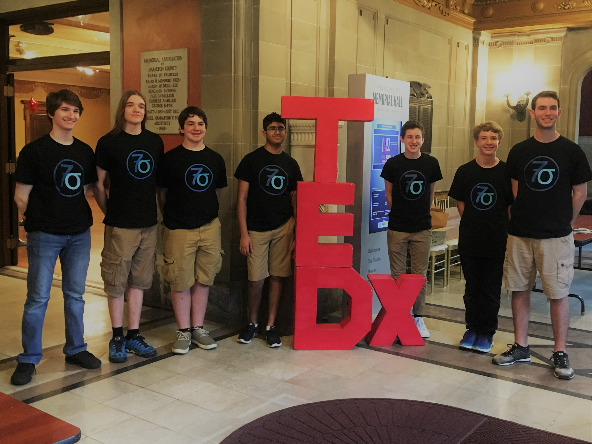
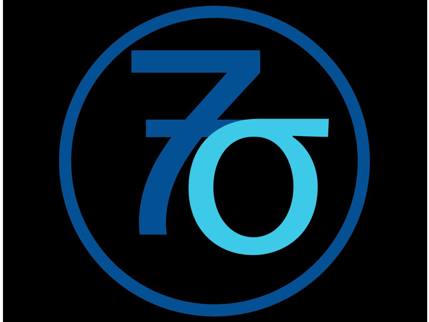
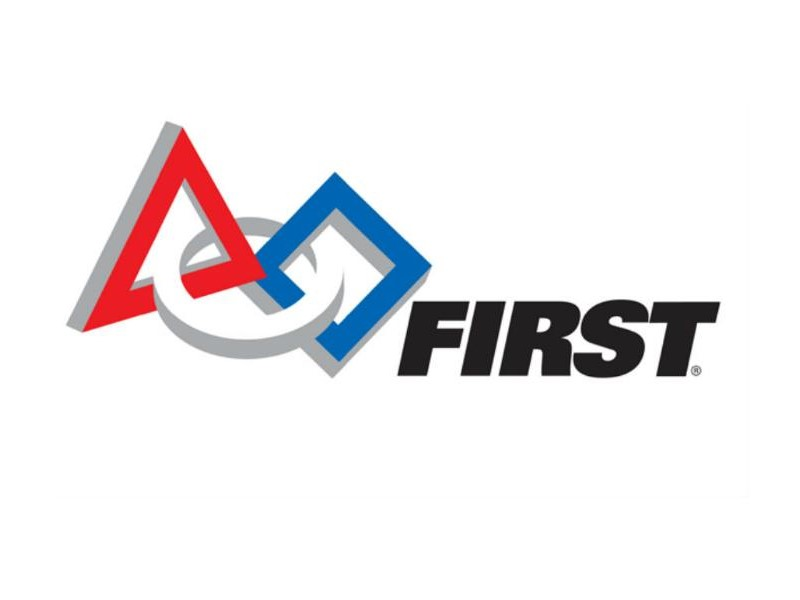
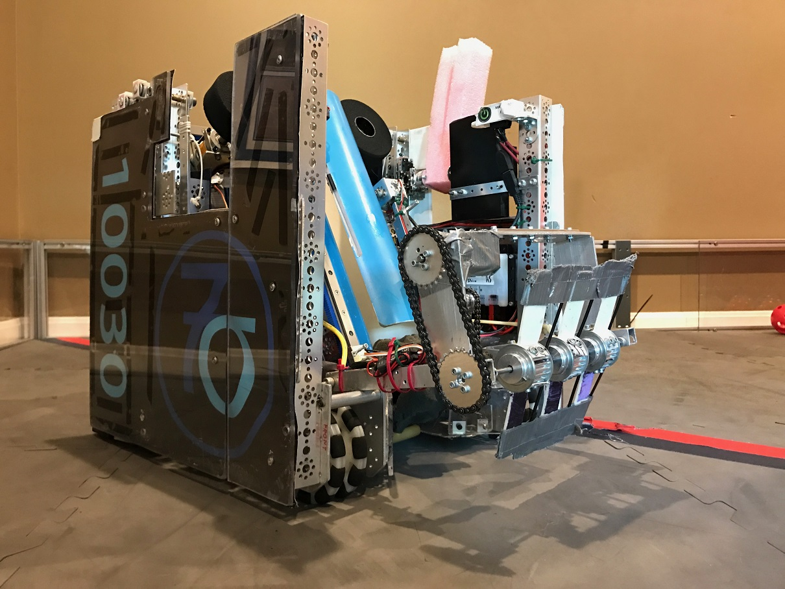
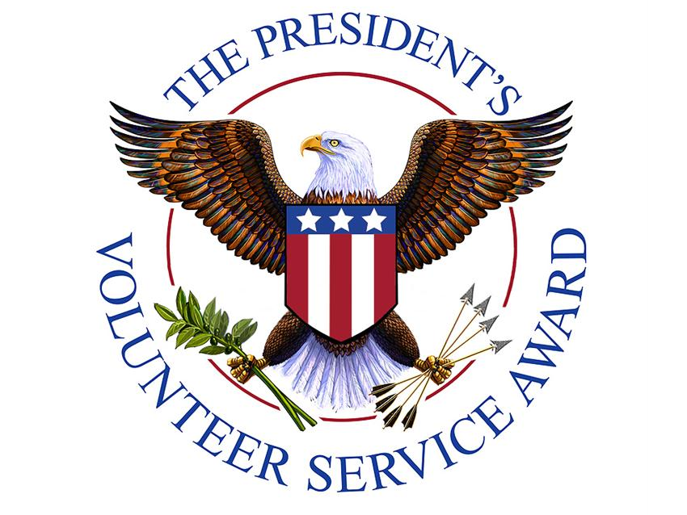

	<h1>7 Sigma Robotics</h1>

	

		<h2>WHO?</h2>
		
We are FTC team 10030, 7 Sigma. We are a neighborhood team from Cincinnati, Ohio comprised of 8 members
		    please contact us at 7sigmarobotics@gmail.com

		
<a href="/who">Learn More</a>

	

	

		
	

	

		
	

	

		<h2>WHAT?</h2>
		
Our team name, 7 Sigma is named after a manufacturing term called 6 Sigma meaning a methodology to acquire perfection or near perfection.

		
<a href="/what">Learn More</a>

	

	

		<h2>WHY?</h2>
		
We compete in a competitive robotics and STEM organization called FIRST. FIRST is designed to give kids who are in the middle/upper school range of ages an opportunity of learning about STEM.

		
<a href="/why">Learn More</a>

	

	

		
	

	

		
	

	

		<h2>HOW?</h2>
		
Our robot (and no, it does not have a name) is designed to pick up and shoot wiffle balls into a hoop called the 'vortex' in the center. The robot also can lift a yoga ball on top of the 'vortex'.

		
<a href="/how">Learn More</a>

	

	

		<h2>OUR ACCOMPLISHMENTS?</h2>
		
Our team has won a number of different awards. hover to learn more 
		

		
<a href="/acc">Learn More</a>

	

	

		
	

	

		
	

	

		<h2>OUR HISTORY?</h2>
		
Our team has been involved in ftc for 5 seasons, growing out of a team called Infinite Resistance.

		
<a href="/history">Learn More</a>

	

	

		<h2>SPONSORS</h2>
		
We compete in a competitive robotics and STEM organization called FIRST. FIRST is designed to give kids who are in the middle/upper school range of ages an opportunity of learning about STEM.

		
<a href="/why">Learn More</a>

	

	

		
	

